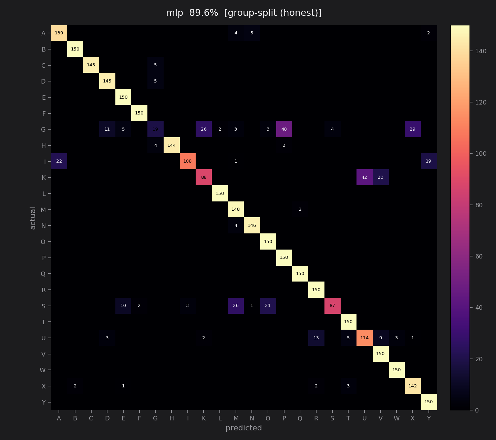
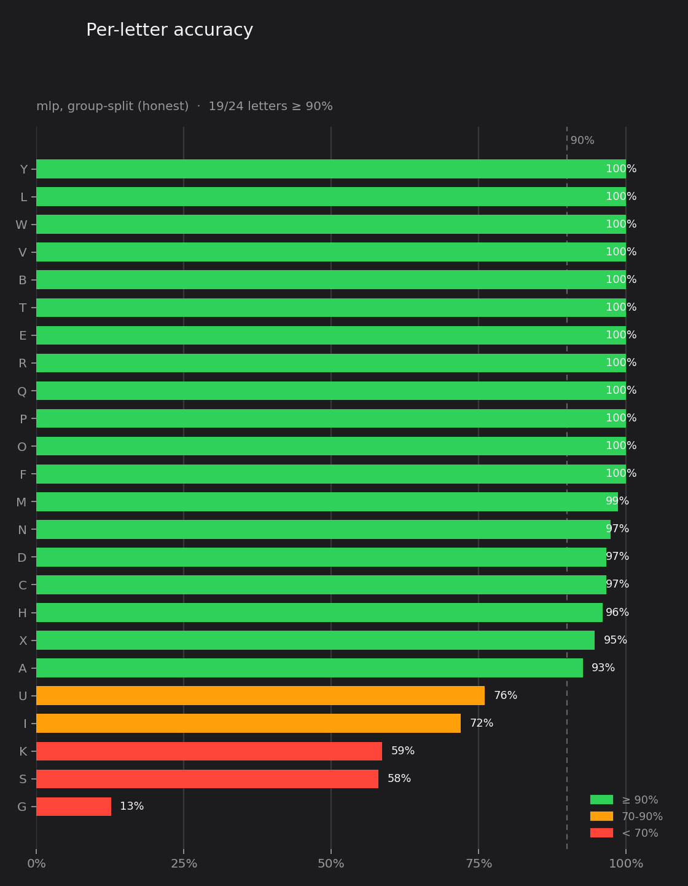

<div align="center">

# 🤟 ASL Fingerspelling Recognition

**Real-time static ASL fingerspelling recognition from a webcam.**
Hold a letter → it locks in → words spell themselves out on screen.


****


<p>
  
  
  
  
  
</p>

<p>
  
  
  
</p>


</div>

<br>

## 📋 Table of Contents

- [How It Works](#-how-it-works)
- [Tech Stack](#-tech-stack)
- [Quick Start](#-quick-start)
- [Project Structure](#-project-structure)
- [Design Decision: Landmarks, Not Pixels](#-design-decision-landmarks-not-pixels)
- [Scope: 24 Letters, Not 26](#-scope-24-letters-not-26)
- [Results](#-results)
- [Tuning](#-tuning)
- [Gestures](#-gestures)
- [What This Is Not](#-what-this-is-not)
- [License](#-license)

<br>

## 🧠 How It Works

A webcam frame flows through this pipeline:

```
Webcam Frame → MediaPipe HandLandmarker → 21 joint coords (63 floats)
             → normalize (translation/scale/mirror invariant)
             → scikit-learn classifier → predicted letter
             → hold-to-commit state machine → locked letter → spelled word
```

**MediaPipe Tasks (`HandLandmarker`)** returns 21 hand-joint coordinates per frame — not pixels, pure geometry. Those 63 numbers (21 points × x, y, z) are normalized and fed into a small **scikit-learn** classifier that predicts one of 24 letters. **OpenCV** handles the camera and renders the UI; a hold-to-commit state machine locks in a letter after ~1.5 seconds of steady hold, so words get spelled out one letter at a time.

<br>

## ⚙️ Tech Stack

<p>
  
  
  
  
  
  
  
</p>

| Library | Role |
|---|---|
| **MediaPipe Tasks** (`HandLandmarker`) | Hand detection + 21-point landmark extraction |
| **scikit-learn** | RandomForest / MLP classifier on the 63-float landmark vector |
| **OpenCV** | Camera I/O, frame processing |
| **Pillow** | Real typography (Inter / JetBrains Mono) rendered onto the OpenCV overlay |
| **pandas / NumPy** | Dataset handling and feature math |
| **matplotlib** | Evaluation charts |

<br>

## 🚀 Quick Start

```bash
git clone https://github.com/muhammadabdullah018/ASL-HandRecognition.git
cd ASL-HandRecognition
pip install -r requirements.txt
python setup_model.py      # downloads hand_landmarker.task (~7MB)
```

Then, in order:

```bash
python collect_data.py     # record your own hand: press a-y, hold each sign
python train_model.py      # trains the classifier, prints accuracy, saves charts to outputs/
python inference.py        # sanity check: one letter at a time
python spell_mode.py       # the full demo: hold letters, spell words
```

Tests (no camera needed):

```bash
python test_landmarks.py
python test_spell_tracker.py
```

<br>

## 📁 Project Structure

<details>
<summary>Click to expand full folder structure</summary>

```
ASL-HandRecognition/
├── config.py                # every tunable constant — letters, paths, thresholds, colors
├── fonts.py                 # loads Inter / JetBrains Mono for the UI
├── landmarks.py              # the only file that imports MediaPipe — extraction + normalization
├── setup_model.py             # downloads the MediaPipe .task model file
├── collect_data.py             # webcam -> data/landmarks.csv, tagged with burst/group ids
├── dataset_from_images.py       # optional: folder-per-class image dataset -> same CSV format
├── train_model.py                # trains + evaluates (naive vs honest split) + generates charts
├── inference.py                   # live single-letter webcam test
├── spell_tracker.py                # hold-to-commit + gesture state machines (pure logic, no I/O)
├── spell_mode.py                    # the full demo — HUD, gestures, hold-progress ring
├── ui.py                             # all drawing primitives (OpenCV shapes + Pillow text)
├── test_landmarks.py                  # unit tests for the feature math (no camera)
├── test_spell_tracker.py               # unit tests for the state machines (no camera)
├── requirements.txt
├── assets/fonts/                        # bundled Inter + JetBrains Mono (SIL OFL license)
├── outputs/                              # confusion matrix + accuracy charts (generated)
├── data/                                  # gitignored — created by collect_data.py
└── models/                                 # gitignored — created by setup_model.py / train_model.py
```

</details>

<br>

## 🔍 Design Decision: Landmarks, Not Pixels

The obvious approach is a CNN trained on photos of hands. This project doesn't do that — on purpose.

| | CNN on raw images | MediaPipe landmarks → small classifier |
|---|---|---|
| Data needed | Thousands of images per letter | A few hundred frames per letter |
| Training | GPU, tens of minutes+ | CPU, seconds |
| Lighting / background | Learns your room, breaks elsewhere | Irrelevant — it never sees pixels |
| Input size | 200×200×3 = 120,000 numbers | 21 points × 3 = **63 numbers** |

MediaPipe already solved the hard vision problem — finding a hand and locating its joints. Putting a 63-input classifier on top of that is the correct architecture, not a shortcut.

<br>

## 🔤 Scope: 24 Letters, Not 26

**J and Z are excluded.** Both are *motion* signs — J draws a hook, Z draws a zigzag. A single-frame classifier has no time axis, so it structurally cannot represent them. This is a stated scope decision, not a bug: adding them would mean an LSTM/GRU over landmark sequences, which is a different project.

<br>

## 📊 Results

Trained on **14,400 samples** — 600 per letter (all 24), across 4 separate recording bursts each, with the hand tilted/rotated/moved between bursts so the model doesn't memorize one exact pose.

| Split | Accuracy | |
|---|---|---|
| Naive (random shuffle, leaky) | 98.6% | ❌ inflated |
| **Group split (whole bursts held out)** | **89.6%** | ✅ the real number |

> That ~9-point gap **is the single most interesting result in this project.** Frames recorded inside one burst are near-duplicates of each other — a random train/test split scatters those duplicates across both sides, so the model gets tested on frames it's effectively already seen. `train_model.py` fixes this with a custom `leave_one_burst_out()` split: one whole burst held out per letter, guaranteed no overlap. **Report the honest number.**

**19 of 24 letters score ≥ 90% accuracy** on the honest split; 12 are at a perfect 100%:

`Y` · `L` · `W` · `V` · `B` · `T` · `E` · `R` · `Q` · `P` · `O` · `F`

The weakest letters are the classic near-identical-fist confusions:

| Letter | Confused with |
|---|---|
| G | P |
| S | M |
| K | U |
| I | A |
| U | R |

See the full breakdown:




<br>

## 🎛 Tuning

Everything lives in `config.py`.

| Symptom | Fix |
|---|---|
| Letters fire before you're ready | `HOLD_SECONDS` ↑, or press `]` live in `spell_mode.py` |
| Feels sluggish | `HOLD_SECONDS` ↓, or press `[` live |
| Flickers between two letters | `SMOOTHING_WINDOW` ↑ to 7-9 |
| Shows garbage when your hand is moving | `CONF_THRESHOLD` ↑ to 0.90 |
| One letter is consistently wrong | Record more bursts of just that letter, retrain |

<br>

## 🖐 Gestures

| Gesture | Action |
|---|---|
| Hold a letter ~1.5s | Locks it in (majority-vote smoothing + timed hold + lock, so it won't spam-repeat) |
| Make a fist with both hands, press them together | Inserts a space |
| Raise both hands near the top of frame, hold ~1s | Celebratory reveal of what you've spelled so far, with confetti — doesn't clear your text or interrupt recognition |

<br>

## ⚠️ What This Is Not

This recognizes **static fingerspelled letters** — it does not "understand sign language." Real ASL is a full language with its own grammar, facial/non-manual markers, and two-handed signs; fingerspelling is a small corner of it, mostly used for proper nouns. Someone who actually signs will notice the difference — being precise about scope is worth more than overclaiming.

<br>

## 📄 License

This project is licensed under the MIT License — see the `LICENSE` file for details.

<br>

<div align="center">

**Muhammad Abdullah Mushtaq**

[](https://github.com/muhammadabdullah018)

⭐ Star this repo if you found it useful.

</div>
